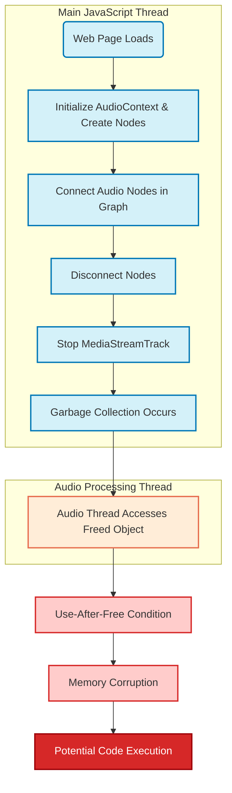

# CVE-2025-4372 WebAudio Use-After-Free Vulnerability Diagram

This diagram illustrates the sequence of events that lead to the CVE-2025-4372 use-after-free vulnerability in Chrome's WebAudio implementation:

1. The process begins when a web page loads and initializes the AudioContext
2. WebAudio nodes are created and connected in an audio graph
3. In the attack scenario, nodes are disconnected and MediaStreamTracks are manipulated (stopped)
4. Under specific timing conditions, the garbage collector frees the MediaStreamAudioDestinationNode memory
5. However, the audio processing thread may still attempt to access this freed memory
6. This results in a use-after-free condition, which can lead to memory corruption
7. With careful exploitation, this memory corruption could potentially be leveraged for code execution

The critical vulnerability occurs due to inadequate synchronization between the main JavaScript thread and the audio processing thread, creating a race condition where objects can be accessed after being freed.

## Diagram Legend

- **Blue boxes**: Operations happening on the main JavaScript thread
- **Orange boxes**: Operations happening on the audio processing thread
- **Red boxes**: Vulnerability conditions and exploitation
- **Dark red box**: Potential end result of successful exploitation